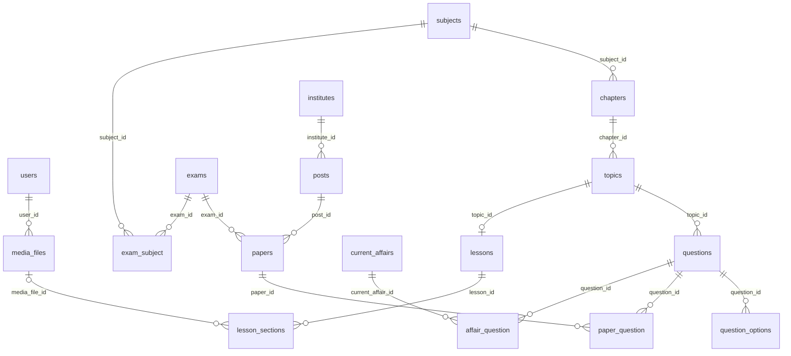
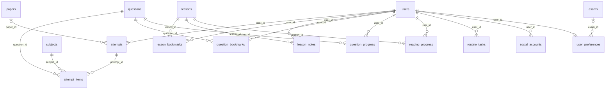

# Database schema and relationships

The original schema was verified against local MySQL 8.4 on 2026-10-01. The additive device-tracking migration adds two tables on 2026-10-03: **42 tables total: 34 application tables and 8 framework/infrastructure tables**, including the four frontend-coverage tables. This document describes the current implementation, not a proposed schema. No application records or credentials are included.

## Table inventory

| Area | Count | Tables |
| --- | ---: | --- |
| Identity and authentication | 6 | [users](#users), [email_otps](#email-otps), [social_accounts](#social-accounts), [user_preferences](#user-preferences), user_devices, device_sessions |
| Study catalogue and files | 6 | [subjects](#subjects), [chapters](#chapters), [topics](#topics), [lessons](#lessons), [lesson_sections](#lesson-sections), [media_files](#media-files) |
| Exams and question bank | 8 | [exams](#exams), [institutes](#institutes), [posts](#posts), [exam_subject](#exam-subject), [papers](#papers), [questions](#questions), [question_options](#question-options), [paper_question](#paper-question) |
| Personal preparation and assessment | 11 | [reading_progress](#reading-progress), [lesson_notes](#lesson-notes), [lesson_bookmarks](#lesson-bookmarks), [question_bookmarks](#question-bookmarks), [attempts](#attempts), [attempt_items](#attempt-items), [question_progress](#question-progress), [routine_tasks](#routine-tasks), routine_plans, question_reviews, question_reports |
| Current affairs and notices | 3 | [current_affairs](#current-affairs), [affair_question](#affair-question), notices |
| Framework infrastructure | 8 | [sessions](#sessions), [password_reset_tokens](#password-reset-tokens), [cache](#cache), [cache_locks](#cache-locks), [jobs](#jobs), [job_batches](#job-batches), [failed_jobs](#failed-jobs), [migrations](#migrations) |

## How to read the schema

- PK = primary key; UNIQUE = duplicate values/combinations are rejected; FK = database-enforced foreign key.
- Unless shown otherwise, columns are required. `NULL` means nullable; “No default” means inserts must supply a value unless auto-generated.
- MySQL represents booleans as `tinyint(1)` and Laravel UUIDs as `char(36)`. UUID generation happens in application code.
- Timestamps use the UTC database session. MySQL does not preserve an original timezone inside the timestamp column; timezone preferences control display.
- MySQL automatically supplies indexes needed by foreign keys. The per-table index lists below reflect the actual database, including those indexes.
- CASCADE deletes dependent rows; RESTRICT blocks deletion while dependents exist; SET NULL preserves the row and clears the reference.
- Mermaid notation: `||` = exactly one, `o|` = zero or one, `o{` = zero or many. Diagrams show database relationships, except explicitly described logical links.

## Relationship diagrams

### Study, question identity and current affairs

### Users, reading and assessment

`email_otps.email` is deliberately independent of users. `sessions.user_id` is an application-level association only, not a declared FK. Framework queue/cache tables have no domain foreign keys.

## Main data flows

1. **Study:** subjects → chapters → topics → lessons → lesson_sections. A user’s position/completion, personal note and bookmark are stored separately.
2. **Find a previous paper:** institutes → posts → papers, filtered by year/stage/exam. paper_question gives the exact ordered questions; there is no fallback to arbitrary subject questions.
3. **Practice/test:** questions and options are copied into attempt_items when an attempt starts. attempts holds timing and scoring rules. Later content edits do not change the captured text/options/rules.
4. **Finalize:** saved answers are scored on the server, attempt totals are updated, and question_progress is updated for subsequent practice filters.
5. **Register/login:** email_otps exists before registration; successful verification creates/authenticates users. social_accounts binds verified external identities to those users.

## Table details

### Identity and authentication

#### `users`

Registered students and administrators. Accounts are created after verified email OTP or accepted Google identity. The nullable password and remember_token are framework fields; no password registration/login API is exposed.

| Column | MySQL type | Nullable | Default / generation |
| --- | --- | --- | --- |
| `id` | `bigint unsigned` | No | No default; auto_increment |
| `name` | `varchar(255)` | No | No default |
| `email` | `varchar(255)` | No | No default |
| `email_verified_at` | `timestamp` | Yes | NULL |
| `password` | `varchar(255)` | Yes | NULL |
| `remember_token` | `varchar(100)` | Yes | NULL |
| `created_at` | `timestamp` | Yes | NULL |
| `updated_at` | `timestamp` | Yes | NULL |
| `role` | `varchar(20)` | No | student |
| `is_active` | `tinyint(1)` | No | 1 |

**Keys and indexes**

- PK `(id)` — `PRIMARY`.
- UNIQUE `(email)` — `users_email_unique`.

**Relations and deletion rules**

No declared foreign keys.

#### `email_otps`

One pending hashed sign-in code per email. This table deliberately has no user foreign key because registration starts before a user exists. Codes are consumed after verification; expiry and failed-attempt limits are enforced in authentication code.

| Column | MySQL type | Nullable | Default / generation |
| --- | --- | --- | --- |
| `email` | `varchar(255)` | No | No default |
| `code_hash` | `varchar(255)` | No | No default |
| `attempts` | `smallint unsigned` | No | 0 |
| `expires_at` | `timestamp` | No | No default |
| `sent_at` | `timestamp` | No | No default |

**Keys and indexes**

- INDEX `(expires_at)` — `email_otps_expires_at_index`.
- PK `(email)` — `PRIMARY`.

**Relations and deletion rules**

No declared foreign keys.

#### `social_accounts`

Links a user to a stable external provider identity. Google provider_id is the subject claim, not the email. Unique keys prevent linking the same identity twice and limit a user to one account per provider.

| Column | MySQL type | Nullable | Default / generation |
| --- | --- | --- | --- |
| `id` | `bigint unsigned` | No | No default; auto_increment |
| `user_id` | `bigint unsigned` | No | No default |
| `provider` | `varchar(20)` | No | No default |
| `provider_id` | `varchar(255)` | No | No default |
| `created_at` | `timestamp` | Yes | NULL |
| `updated_at` | `timestamp` | Yes | NULL |

**Keys and indexes**

- PK `(id)` — `PRIMARY`.
- UNIQUE `(provider, provider_id)` — `social_accounts_provider_provider_id_unique`.
- UNIQUE `(user_id, provider)` — `social_accounts_user_id_provider_unique`.

**Relations and deletion rules**

- `user_id` → `users.id`; ON DELETE **CASCADE**.

#### `user_preferences`

Optional one-to-one preparation and display settings for a user. exam_id is the target exam. A missing preference row is allowed. Reminder fields store preferences; they do not themselves schedule notifications.

| Column | MySQL type | Nullable | Default / generation |
| --- | --- | --- | --- |
| `user_id` | `bigint unsigned` | No | No default |
| `exam_id` | `bigint unsigned` | Yes | NULL |
| `daily_minutes` | `smallint unsigned` | No | 30 |
| `daily_questions` | `smallint unsigned` | No | 10 |
| `target_date` | `date` | Yes | NULL |
| `theme` | `varchar(20)` | No | light |
| `font_size` | `varchar(20)` | No | standard |
| `reminder` | `tinyint(1)` | No | 0 |
| `reminder_time` | `time` | No | 20:00:00 |
| `timezone` | `varchar(80)` | No | Asia/Dhaka |
| `created_at` | `timestamp` | Yes | NULL |
| `updated_at` | `timestamp` | Yes | NULL |

**Keys and indexes**

- PK `(user_id)` — `PRIMARY`.
- INDEX `(exam_id)` — `user_preferences_exam_id_foreign`.

**Relations and deletion rules**

- `exam_id` → `exams.id`; ON DELETE **SET NULL**.
- `user_id` → `users.id`; ON DELETE **CASCADE**.

### Study catalogue and files

#### `subjects`

Top-level study subjects. position controls display order; slug is the stable unique label.

| Column | MySQL type | Nullable | Default / generation |
| --- | --- | --- | --- |
| `id` | `bigint unsigned` | No | No default; auto_increment |
| `title` | `varchar(255)` | No | No default |
| `slug` | `varchar(255)` | No | No default |
| `position` | `int unsigned` | No | 0 |
| `created_at` | `timestamp` | Yes | NULL |
| `updated_at` | `timestamp` | Yes | NULL |

**Keys and indexes**

- PK `(id)` — `PRIMARY`.
- UNIQUE `(slug)` — `subjects_slug_unique`.

**Relations and deletion rules**

No declared foreign keys.

#### `chapters`

Chapters owned by one subject. overview describes learning goals; position orders chapters within the subject.

| Column | MySQL type | Nullable | Default / generation |
| --- | --- | --- | --- |
| `id` | `bigint unsigned` | No | No default; auto_increment |
| `subject_id` | `bigint unsigned` | No | No default |
| `title` | `varchar(255)` | No | No default |
| `overview` | `text` | Yes | NULL |
| `position` | `int unsigned` | No | 0 |
| `created_at` | `timestamp` | Yes | NULL |
| `updated_at` | `timestamp` | Yes | NULL |

**Keys and indexes**

- INDEX `(subject_id)` — `chapters_subject_id_index`.
- PK `(id)` — `PRIMARY`.

**Relations and deletion rules**

- `subject_id` → `subjects.id`; ON DELETE **RESTRICT**.

#### `topics`

Topics owned by one chapter. A topic can have one lesson and multiple questions.

| Column | MySQL type | Nullable | Default / generation |
| --- | --- | --- | --- |
| `id` | `bigint unsigned` | No | No default; auto_increment |
| `chapter_id` | `bigint unsigned` | No | No default |
| `title` | `varchar(255)` | No | No default |
| `position` | `int unsigned` | No | 0 |
| `created_at` | `timestamp` | Yes | NULL |
| `updated_at` | `timestamp` | Yes | NULL |

**Keys and indexes**

- PK `(id)` — `PRIMARY`.
- INDEX `(chapter_id)` — `topics_chapter_id_index`.

**Relations and deletion rules**

- `chapter_id` → `chapters.id`; ON DELETE **RESTRICT**.

#### `lessons`

Complete lesson content for a topic. The unique topic_id permits at most one lesson per topic. summary and reading_minutes support chapter overview; published controls student visibility.

| Column | MySQL type | Nullable | Default / generation |
| --- | --- | --- | --- |
| `id` | `bigint unsigned` | No | No default; auto_increment |
| `topic_id` | `bigint unsigned` | No | No default |
| `summary` | `text` | No | No default |
| `reading_minutes` | `smallint unsigned` | No | 3 |
| `published` | `tinyint(1)` | No | 0 |
| `is_demo` | `tinyint(1)` | No | 0 |
| `created_at` | `timestamp` | Yes | NULL |
| `updated_at` | `timestamp` | Yes | NULL |

**Keys and indexes**

- INDEX `(published)` — `lessons_published_index`.
- UNIQUE `(topic_id)` — `lessons_topic_id_unique`.
- PK `(id)` — `PRIMARY`.

**Relations and deletion rules**

- `topic_id` → `topics.id`; ON DELETE **RESTRICT**.

#### `lesson_sections`

Ordered sections of a lesson. kind is validated by the API as explanation, example, formula, important or mistake. Optional media_file_id attaches an image/file. Each position is unique within a lesson.

| Column | MySQL type | Nullable | Default / generation |
| --- | --- | --- | --- |
| `id` | `bigint unsigned` | No | No default; auto_increment |
| `lesson_id` | `bigint unsigned` | No | No default |
| `title` | `varchar(255)` | No | No default |
| `kind` | `varchar(30)` | No | explanation |
| `body` | `text` | No | No default |
| `media_file_id` | `bigint unsigned` | Yes | NULL |
| `position` | `int unsigned` | No | No default |

**Keys and indexes**

- UNIQUE `(lesson_id, position)` — `lesson_sections_lesson_id_position_unique`.
- INDEX `(media_file_id)` — `lesson_sections_media_file_id_foreign`.
- PK `(id)` — `PRIMARY`.

**Relations and deletion rules**

- `lesson_id` → `lessons.id`; ON DELETE **CASCADE**.
- `media_file_id` → `media_files.id`; ON DELETE **RESTRICT**.

#### `media_files`

Private file metadata. user_id identifies the uploader, disk selects local or R2 storage, path is the server-generated object key, name is the original filename and size is in bytes. Binary file contents are not stored in MySQL.

| Column | MySQL type | Nullable | Default / generation |
| --- | --- | --- | --- |
| `id` | `bigint unsigned` | No | No default; auto_increment |
| `user_id` | `bigint unsigned` | No | No default |
| `disk` | `varchar(30)` | No | No default |
| `path` | `varchar(255)` | No | No default |
| `name` | `varchar(255)` | No | No default |
| `mime` | `varchar(100)` | No | No default |
| `size` | `bigint unsigned` | No | No default |
| `published` | `tinyint(1)` | No | 0 |
| `created_at` | `timestamp` | Yes | NULL |
| `updated_at` | `timestamp` | Yes | NULL |

**Keys and indexes**

- UNIQUE `(path)` — `media_files_path_unique`.
- INDEX `(user_id)` — `media_files_user_id_foreign`.
- PK `(id)` — `PRIMARY`.

**Relations and deletion rules**

- `user_id` → `users.id`; ON DELETE **RESTRICT**.

### Exams and question bank

#### `exams`

Preparation tracks such as BCS or Bank. Subjects and exam-specific syllabus text are connected through exam_subject.

| Column | MySQL type | Nullable | Default / generation |
| --- | --- | --- | --- |
| `id` | `bigint unsigned` | No | No default; auto_increment |
| `title` | `varchar(255)` | No | No default |
| `slug` | `varchar(255)` | No | No default |
| `created_at` | `timestamp` | Yes | NULL |
| `updated_at` | `timestamp` | Yes | NULL |

**Keys and indexes**

- UNIQUE `(slug)` — `exams_slug_unique`.
- PK `(id)` — `PRIMARY`.

**Relations and deletion rules**

No declared foreign keys.

#### `institutes`

Institutions that organize recruitment examinations. Each institute owns posts.

| Column | MySQL type | Nullable | Default / generation |
| --- | --- | --- | --- |
| `id` | `bigint unsigned` | No | No default; auto_increment |
| `title` | `varchar(255)` | No | No default |
| `slug` | `varchar(255)` | No | No default |
| `created_at` | `timestamp` | Yes | NULL |
| `updated_at` | `timestamp` | Yes | NULL |

**Keys and indexes**

- UNIQUE `(slug)` — `institutes_slug_unique`.
- PK `(id)` — `PRIMARY`.

**Relations and deletion rules**

No declared foreign keys.

#### `posts`

Recruitment positions belonging to an institute. Papers identify their institute indirectly through this table.

| Column | MySQL type | Nullable | Default / generation |
| --- | --- | --- | --- |
| `id` | `bigint unsigned` | No | No default; auto_increment |
| `institute_id` | `bigint unsigned` | No | No default |
| `title` | `varchar(255)` | No | No default |
| `created_at` | `timestamp` | Yes | NULL |
| `updated_at` | `timestamp` | Yes | NULL |

**Keys and indexes**

- INDEX `(institute_id)` — `posts_institute_id_index`.
- PK `(id)` — `PRIMARY`.

**Relations and deletion rules**

- `institute_id` → `institutes.id`; ON DELETE **RESTRICT**.

#### `exam_subject`

Many-to-many link between exam tracks and subjects. syllabus stores the scope for that subject in that exam; the composite primary key prevents duplicate assignments.

| Column | MySQL type | Nullable | Default / generation |
| --- | --- | --- | --- |
| `exam_id` | `bigint unsigned` | No | No default |
| `subject_id` | `bigint unsigned` | No | No default |
| `syllabus` | `text` | Yes | NULL |

**Keys and indexes**

- INDEX `(subject_id)` — `exam_subject_subject_id_index`.
- PK `(exam_id, subject_id)` — `PRIMARY`.

**Relations and deletion rules**

- `exam_id` → `exams.id`; ON DELETE **CASCADE**.
- `subject_id` → `subjects.id`; ON DELETE **RESTRICT**.

#### `papers`

An identifiable examination paper: exam track, recruitment post, year, stage, source and publication/verification flags. duration_minutes, correct_marks and wrong_penalty define server-owned test rules. The same post/year can have multiple stages or papers.

| Column | MySQL type | Nullable | Default / generation |
| --- | --- | --- | --- |
| `id` | `bigint unsigned` | No | No default; auto_increment |
| `exam_id` | `bigint unsigned` | No | No default |
| `post_id` | `bigint unsigned` | No | No default |
| `title` | `varchar(255)` | No | No default |
| `year` | `smallint unsigned` | No | No default |
| `stage` | `varchar(80)` | No | No default |
| `source` | `text` | No | No default |
| `verified` | `tinyint(1)` | No | 0 |
| `is_demo` | `tinyint(1)` | No | 0 |
| `published` | `tinyint(1)` | No | 0 |
| `duration_minutes` | `smallint unsigned` | No | No default |
| `correct_marks` | `decimal(6,2)` | No | 1.00 |
| `wrong_penalty` | `decimal(6,2)` | No | 0.00 |
| `created_at` | `timestamp` | Yes | NULL |
| `updated_at` | `timestamp` | Yes | NULL |

**Keys and indexes**

- INDEX `(exam_id)` — `papers_exam_id_index`.
- INDEX `(post_id)` — `papers_post_id_foreign`.
- INDEX `(published, post_id, year)` — `papers_published_post_id_year_index`.
- INDEX `(published, year, id)` — `papers_published_year_id_index`.
- PK `(id)` — `PRIMARY`.

**Relations and deletion rules**

- `exam_id` → `exams.id`; ON DELETE **RESTRICT**.
- `post_id` → `posts.id`; ON DELETE **RESTRICT**.

#### `questions`

Reusable question content owned by a topic. Source and verification metadata describe reliability. Subject and chapter are obtained through topic relationships; institute, post, year and stage come from the papers containing this question.

| Column | MySQL type | Nullable | Default / generation |
| --- | --- | --- | --- |
| `id` | `bigint unsigned` | No | No default; auto_increment |
| `topic_id` | `bigint unsigned` | No | No default |
| `text` | `text` | No | No default |
| `explanation` | `text` | No | No default |
| `source` | `text` | No | No default |
| `verified` | `tinyint(1)` | No | 0 |
| `is_demo` | `tinyint(1)` | No | 0 |
| `published` | `tinyint(1)` | No | 0 |
| `created_at` | `timestamp` | Yes | NULL |
| `updated_at` | `timestamp` | Yes | NULL |

**Keys and indexes**

- PK `(id)` — `PRIMARY`.
- INDEX `(published, id)` — `questions_published_id_index`.
- INDEX `(topic_id, published, id)` — `questions_topic_id_published_id_index`.

**Relations and deletion rules**

- `topic_id` → `topics.id`; ON DELETE **RESTRICT**.

#### `question_options`

Ordered answer choices for one question. is_correct marks the correct answer. Exactly one correct option is enforced by the content API, not by a database CHECK constraint.

| Column | MySQL type | Nullable | Default / generation |
| --- | --- | --- | --- |
| `id` | `bigint unsigned` | No | No default; auto_increment |
| `question_id` | `bigint unsigned` | No | No default |
| `text` | `text` | No | No default |
| `position` | `smallint unsigned` | No | No default |
| `is_correct` | `tinyint(1)` | No | 0 |

**Keys and indexes**

- PK `(id)` — `PRIMARY`.
- UNIQUE `(question_id, position)` — `question_options_question_id_position_unique`.

**Relations and deletion rules**

- `question_id` → `questions.id`; ON DELETE **CASCADE**.

#### `paper_question`

Many-to-many membership between papers and questions. A question can appear in several papers without duplicating content. The primary key prevents repetition within a paper; unique paper_id/position preserves ordering.

| Column | MySQL type | Nullable | Default / generation |
| --- | --- | --- | --- |
| `paper_id` | `bigint unsigned` | No | No default |
| `question_id` | `bigint unsigned` | No | No default |
| `position` | `int unsigned` | No | No default |

**Keys and indexes**

- UNIQUE `(paper_id, position)` — `paper_question_paper_id_position_unique`.
- INDEX `(question_id)` — `paper_question_question_id_index`.
- PK `(paper_id, question_id)` — `PRIMARY`.

**Relations and deletion rules**

- `paper_id` → `papers.id`; ON DELETE **CASCADE**.
- `question_id` → `questions.id`; ON DELETE **RESTRICT**.

### Personal preparation and assessment

#### `reading_progress`

One reading state per user and lesson. position is a client-defined reading offset; completed_at is null until completed. updated_at supports Continue Reading.

| Column | MySQL type | Nullable | Default / generation |
| --- | --- | --- | --- |
| `user_id` | `bigint unsigned` | No | No default |
| `lesson_id` | `bigint unsigned` | No | No default |
| `position` | `int unsigned` | No | 0 |
| `completed_at` | `timestamp` | Yes | NULL |
| `updated_at` | `timestamp` | No | No default |

**Keys and indexes**

- PK `(user_id, lesson_id)` — `PRIMARY`.
- INDEX `(lesson_id)` — `reading_progress_lesson_id_foreign`.
- INDEX `(user_id, updated_at)` — `reading_progress_user_id_updated_at_index`.

**Relations and deletion rules**

- `lesson_id` → `lessons.id`; ON DELETE **CASCADE**.
- `user_id` → `users.id`; ON DELETE **CASCADE**.

#### `lesson_notes`

One personal note per user and lesson. User-scoped content is kept separate from published lesson content.

| Column | MySQL type | Nullable | Default / generation |
| --- | --- | --- | --- |
| `user_id` | `bigint unsigned` | No | No default |
| `lesson_id` | `bigint unsigned` | No | No default |
| `body` | `text` | No | No default |
| `updated_at` | `timestamp` | No | No default |

**Keys and indexes**

- INDEX `(lesson_id)` — `lesson_notes_lesson_id_foreign`.
- PK `(user_id, lesson_id)` — `PRIMARY`.

**Relations and deletion rules**

- `lesson_id` → `lessons.id`; ON DELETE **CASCADE**.
- `user_id` → `users.id`; ON DELETE **CASCADE**.

#### `lesson_bookmarks`

Saved lessons for each user. Row existence means bookmarked; the composite primary key prevents duplicates. Backend support remains even when the frontend control is hidden.

| Column | MySQL type | Nullable | Default / generation |
| --- | --- | --- | --- |
| `user_id` | `bigint unsigned` | No | No default |
| `lesson_id` | `bigint unsigned` | No | No default |
| `created_at` | `timestamp` | No | No default |

**Keys and indexes**

- INDEX `(lesson_id)` — `lesson_bookmarks_lesson_id_foreign`.
- PK `(user_id, lesson_id)` — `PRIMARY`.

**Relations and deletion rules**

- `lesson_id` → `lessons.id`; ON DELETE **CASCADE**.
- `user_id` → `users.id`; ON DELETE **CASCADE**.

#### `question_bookmarks`

Saved questions for each user. Uses a real question foreign key rather than a polymorphic ID shared with lessons.

| Column | MySQL type | Nullable | Default / generation |
| --- | --- | --- | --- |
| `user_id` | `bigint unsigned` | No | No default |
| `question_id` | `bigint unsigned` | No | No default |
| `created_at` | `timestamp` | No | No default |

**Keys and indexes**

- PK `(user_id, question_id)` — `PRIMARY`.
- INDEX `(question_id)` — `question_bookmarks_question_id_foreign`.

**Relations and deletion rules**

- `question_id` → `questions.id`; ON DELETE **CASCADE**.
- `user_id` → `users.id`; ON DELETE **CASCADE**.

#### `attempts`

One practice session or exam attempt. UUID id identifies the attempt; request_id deduplicates client retries per user. paper_id is optional for custom practice. Scoring rules are copied at creation, score is null before finalization, and nullable expires_at allows untimed practice. mode is practice/exam; status is active/submitted, validated in application code.

| Column | MySQL type | Nullable | Default / generation |
| --- | --- | --- | --- |
| `id` | `char(36)` | No | No default |
| `user_id` | `bigint unsigned` | No | No default |
| `request_id` | `char(36)` | No | No default |
| `paper_id` | `bigint unsigned` | Yes | NULL |
| `title` | `varchar(255)` | No | No default |
| `mode` | `varchar(20)` | No | No default |
| `status` | `varchar(20)` | No | active |
| `correct_marks` | `decimal(6,2)` | No | No default |
| `wrong_penalty` | `decimal(6,2)` | No | No default |
| `score` | `decimal(9,2)` | Yes | NULL |
| `correct_count` | `int unsigned` | No | 0 |
| `wrong_count` | `int unsigned` | No | 0 |
| `skipped_count` | `int unsigned` | No | 0 |
| `started_at` | `timestamp` | No | No default |
| `expires_at` | `timestamp` | Yes | NULL |
| `submitted_at` | `timestamp` | Yes | NULL |

**Keys and indexes**

- INDEX `(paper_id)` — `attempts_paper_id_foreign`.
- INDEX `(status, expires_at)` — `attempts_status_expires_at_index`.
- UNIQUE `(user_id, request_id)` — `attempts_user_id_request_id_unique`.
- INDEX `(user_id, status, started_at)` — `attempts_user_id_status_started_at_index`.
- PK `(id)` — `PRIMARY`.

**Relations and deletion rules**

- `paper_id` → `papers.id`; ON DELETE **RESTRICT**.
- `user_id` → `users.id`; ON DELETE **CASCADE**.

#### `attempt_items`

Immutable question content and choice snapshots for an attempt, with mutable submitted answer fields. options is a JSON array of choice text; it is a historical snapshot, not the live question catalogue. correct_option and selected_option are zero-based indexes. is_correct is populated at finalization; null selection means skipped. subject_id preserves subject attribution for the attempt.

| Column | MySQL type | Nullable | Default / generation |
| --- | --- | --- | --- |
| `id` | `bigint unsigned` | No | No default; auto_increment |
| `attempt_id` | `char(36)` | No | No default |
| `question_id` | `bigint unsigned` | No | No default |
| `subject_id` | `bigint unsigned` | No | No default |
| `position` | `int unsigned` | No | No default |
| `text` | `text` | No | No default |
| `options` | `json` | No | No default |
| `correct_option` | `smallint unsigned` | No | No default |
| `explanation` | `text` | No | No default |
| `source` | `text` | No | No default |
| `verified` | `tinyint(1)` | No | No default |
| `is_demo` | `tinyint(1)` | No | No default |
| `selected_option` | `smallint unsigned` | Yes | NULL |
| `is_correct` | `tinyint(1)` | Yes | NULL |
| `answered_at` | `timestamp` | Yes | NULL |

**Keys and indexes**

- UNIQUE `(attempt_id, position)` — `attempt_items_attempt_id_position_unique`.
- UNIQUE `(attempt_id, question_id)` — `attempt_items_attempt_id_question_id_unique`.
- INDEX `(question_id)` — `attempt_items_question_id_foreign`.
- INDEX `(subject_id)` — `attempt_items_subject_id_foreign`.
- PK `(id)` — `PRIMARY`.

**Relations and deletion rules**

- `attempt_id` → `attempts.id`; ON DELETE **CASCADE**.
- `question_id` → `questions.id`; ON DELETE **RESTRICT**.
- `subject_id` → `subjects.id`; ON DELETE **RESTRICT**.

#### `question_progress`

Latest finalized outcome per user/question for fast new/wrong/skipped filtering. last_status is correct, wrong or skipped. A question is new when no row exists. attempt_count counts finalized appearances; this table is a summary, while attempts/items retain history.

| Column | MySQL type | Nullable | Default / generation |
| --- | --- | --- | --- |
| `user_id` | `bigint unsigned` | No | No default |
| `question_id` | `bigint unsigned` | No | No default |
| `last_status` | `varchar(20)` | No | No default |
| `attempt_count` | `int unsigned` | No | 1 |
| `last_attempted_at` | `timestamp` | No | No default |

**Keys and indexes**

- PK `(user_id, question_id)` — `PRIMARY`.
- INDEX `(question_id)` — `question_progress_question_id_foreign`.
- INDEX `(user_id, last_status)` — `question_progress_user_id_last_status_index`.

**Relations and deletion rules**

- `question_id` → `questions.id`; ON DELETE **CASCADE**.
- `user_id` → `users.id`; ON DELETE **CASCADE**.

#### `routine_tasks`

Daily preparation tasks owned by a user. date is the planned day, minutes is planned duration, and completed_at marks completion.

| Column | MySQL type | Nullable | Default / generation |
| --- | --- | --- | --- |
| `id` | `bigint unsigned` | No | No default; auto_increment |
| `user_id` | `bigint unsigned` | No | No default |
| `date` | `date` | No | No default |
| `title` | `varchar(255)` | No | No default |
| `minutes` | `smallint unsigned` | No | No default |
| `completed_at` | `timestamp` | Yes | NULL |
| `created_at` | `timestamp` | Yes | NULL |
| `updated_at` | `timestamp` | Yes | NULL |

**Keys and indexes**

- PK `(id)` — `PRIMARY`.
- INDEX `(user_id, date)` — `routine_tasks_user_id_date_index`.

**Relations and deletion rules**

- `user_id` → `users.id`; ON DELETE **CASCADE**.

### Current affairs

#### `current_affairs`

Dated study updates with source and publication flags. publication_date enables month-wise reads; related quiz questions live in affair_question.

| Column | MySQL type | Nullable | Default / generation |
| --- | --- | --- | --- |
| `id` | `bigint unsigned` | No | No default; auto_increment |
| `title` | `varchar(255)` | No | No default |
| `body` | `text` | No | No default |
| `source` | `text` | No | No default |
| `publication_date` | `date` | No | No default |
| `is_demo` | `tinyint(1)` | No | 0 |
| `published` | `tinyint(1)` | No | 0 |
| `created_at` | `timestamp` | Yes | NULL |
| `updated_at` | `timestamp` | Yes | NULL |

**Keys and indexes**

- INDEX `(published, publication_date)` — `current_affairs_published_publication_date_index`.
- PK `(id)` — `PRIMARY`.

**Relations and deletion rules**

No declared foreign keys.

#### `affair_question`

Many-to-many link between current-affairs entries and questions. The composite primary key prevents duplicate links.

| Column | MySQL type | Nullable | Default / generation |
| --- | --- | --- | --- |
| `current_affair_id` | `bigint unsigned` | No | No default |
| `question_id` | `bigint unsigned` | No | No default |

**Keys and indexes**

- INDEX `(question_id)` — `affair_question_question_id_index`.
- PK `(current_affair_id, question_id)` — `PRIMARY`.

**Relations and deletion rules**

- `current_affair_id` → `current_affairs.id`; ON DELETE **CASCADE**.
- `question_id` → `questions.id`; ON DELETE **RESTRICT**.

### Framework infrastructure

#### `sessions`

Laravel database-backed browser sessions. payload holds serialized session state and last_activity is Unix time. user_id is indexed but intentionally has no declared database foreign key; authentication owns this logical relationship.

| Column | MySQL type | Nullable | Default / generation |
| --- | --- | --- | --- |
| `id` | `varchar(255)` | No | No default |
| `user_id` | `bigint unsigned` | Yes | NULL |
| `ip_address` | `varchar(45)` | Yes | NULL |
| `user_agent` | `text` | Yes | NULL |
| `payload` | `longtext` | No | No default |
| `last_activity` | `int` | No | No default |

**Keys and indexes**

- PK `(id)` — `PRIMARY`.
- INDEX `(last_activity)` — `sessions_last_activity_index`.
- INDEX `(user_id)` — `sessions_user_id_index`.

**Relations and deletion rules**

No declared foreign keys.

#### `password_reset_tokens`

Unused framework scaffold for password-reset flows. No password reset API currently writes this table; email is its primary key and is not a foreign key.

| Column | MySQL type | Nullable | Default / generation |
| --- | --- | --- | --- |
| `email` | `varchar(255)` | No | No default |
| `token` | `varchar(255)` | No | No default |
| `created_at` | `timestamp` | Yes | NULL |

**Keys and indexes**

- PK `(email)` — `PRIMARY`.

**Relations and deletion rules**

No declared foreign keys.

#### `cache`

Laravel cache entries, including cached Google signing keys and rate-limit data when the database cache store is selected. expiration is an epoch timestamp.

| Column | MySQL type | Nullable | Default / generation |
| --- | --- | --- | --- |
| `key` | `varchar(255)` | No | No default |
| `value` | `mediumtext` | No | No default |
| `expiration` | `bigint` | No | No default |

**Keys and indexes**

- INDEX `(expiration)` — `cache_expiration_index`.
- PK `(key)` — `PRIMARY`.

**Relations and deletion rules**

No declared foreign keys.

#### `cache_locks`

Laravel atomic lock ownership and expiration. Used for concurrency protection such as OTP issuance and Google linking.

| Column | MySQL type | Nullable | Default / generation |
| --- | --- | --- | --- |
| `key` | `varchar(255)` | No | No default |
| `owner` | `varchar(255)` | No | No default |
| `expiration` | `bigint` | No | No default |

**Keys and indexes**

- INDEX `(expiration)` — `cache_locks_expiration_index`.
- PK `(key)` — `PRIMARY`.

**Relations and deletion rules**

No declared foreign keys.

#### `jobs`

Framework queued job payloads and reservation/retry state. Timestamp-like fields are Unix integers. Current OTP delivery is synchronous, so this table is not the OTP delivery pipeline.

| Column | MySQL type | Nullable | Default / generation |
| --- | --- | --- | --- |
| `id` | `bigint unsigned` | No | No default; auto_increment |
| `queue` | `varchar(255)` | No | No default |
| `payload` | `longtext` | No | No default |
| `attempts` | `smallint unsigned` | No | No default |
| `reserved_at` | `int unsigned` | Yes | NULL |
| `available_at` | `int unsigned` | No | No default |
| `created_at` | `int unsigned` | No | No default |

**Keys and indexes**

- INDEX `(queue)` — `jobs_queue_index`.
- PK `(id)` — `PRIMARY`.

**Relations and deletion rules**

No declared foreign keys.

#### `job_batches`

Framework metadata for batches of queued jobs. Retained scaffold; current feature workflows do not require job batches.

| Column | MySQL type | Nullable | Default / generation |
| --- | --- | --- | --- |
| `id` | `varchar(255)` | No | No default |
| `name` | `varchar(255)` | No | No default |
| `total_jobs` | `int` | No | No default |
| `pending_jobs` | `int` | No | No default |
| `failed_jobs` | `int` | No | No default |
| `failed_job_ids` | `longtext` | No | No default |
| `options` | `mediumtext` | Yes | NULL |
| `cancelled_at` | `int` | Yes | NULL |
| `created_at` | `int` | No | No default |
| `finished_at` | `int` | Yes | NULL |

**Keys and indexes**

- PK `(id)` — `PRIMARY`.

**Relations and deletion rules**

No declared foreign keys.

#### `failed_jobs`

Framework failed queue-job records, payload and exception details. Access should remain restricted to backend operations.

| Column | MySQL type | Nullable | Default / generation |
| --- | --- | --- | --- |
| `id` | `bigint unsigned` | No | No default; auto_increment |
| `uuid` | `varchar(255)` | No | No default |
| `connection` | `varchar(255)` | No | No default |
| `queue` | `varchar(255)` | No | No default |
| `payload` | `longtext` | No | No default |
| `exception` | `longtext` | No | No default |
| `failed_at` | `timestamp` | No | CURRENT_TIMESTAMP; DEFAULT_GENERATED |

**Keys and indexes**

- INDEX `(connection, queue, failed_at)` — `failed_jobs_connection_queue_failed_at_index`.
- UNIQUE `(uuid)` — `failed_jobs_uuid_unique`.
- PK `(id)` — `PRIMARY`.

**Relations and deletion rules**

No declared foreign keys.

#### `migrations`

Laravel migration ledger. Records migration filenames and their batch numbers; this is infrastructure, not student content.

| Column | MySQL type | Nullable | Default / generation |
| --- | --- | --- | --- |
| `id` | `int unsigned` | No | No default; auto_increment |
| `migration` | `varchar(255)` | No | No default |
| `batch` | `int` | No | No default |

**Keys and indexes**

- PK `(id)` — `PRIMARY`.

**Relations and deletion rules**

No declared foreign keys.

## Important constraints and implementation boundaries

- Single-correct-option rules, allowed status/kind strings, verification before publication, chapter completion gates and one active attempt per user are enforced by application logic; they are not SQL enum/CHECK constraints.
- `users.email` is unique; provider identity and per-user request IDs also have database uniqueness guarantees. MySQL string comparisons use the configured utf8mb4 collation.
- Lessons and questions reference topics; papers reference posts and exams. Duplicating institute/year onto every question is unnecessary because a question can belong to multiple papers.
- Attempt snapshots deliberately duplicate historical content. The live catalogue remains relational; the JSON options snapshot avoids linking past attempts to mutable option rows.
- Parent content referenced by papers/attempts often uses RESTRICT to protect history. Deleting a user cascades personal preparation records, but uploaded media can block deletion through its RESTRICT reference.
- No soft-delete columns are present. Publication flags hide content; DELETE operations are physical where exposed and allowed.
- Hidden frontend bookmark/font controls do not remove their existing backend tables/preferences.
- Indexes improve the supported filters but do not guarantee a particular response time. Production-sized load and query-plan checks remain separate work.

## Source of truth

- [Migrations](../database/migrations/) define schema changes.
- [API behavior and validation](API.md) describes endpoint payloads and application constraints.
- [Backend setup](../README.md) explains MySQL configuration and local development.

When a migration changes columns, indexes or relations, update this document alongside it.

## Device tracking tables

`user_devices` belongs to a user (cascade delete), with a unique `(user_id, device_id)` installation UUID. It stores platform, nullable device name/OS/app version, first and last login, and timestamps.

`device_sessions` has a UUID primary key and belongs to `user_devices` (cascade delete). It stores nullable IP and user agent, login time, last seen, indexed expiry, and nullable revoked time. The tracking UUID is stored in the authenticated Laravel session; it is not an authentication token. Multiple sessions can belong to one device. Count distinct devices with unrevoked, unexpired sessions when implementing a future device limit.

## Frontend coverage schema additions (2026-10-03)

The following extends the original column tables above. Migration: `2026_10_03_000002_complete_frontend_coverage.php`. See [field mappings and API contracts](FRONTEND-COVERAGE.md).

| Table | Added columns and constraints |
| --- | --- |
| subjects/chapters/topics | Nullable english/bengali VARCHAR(255) |
| subjects | Nullable short VARCHAR(80), symbol VARCHAR(40), color VARCHAR(30) |
| user_preferences | Nullable JSON focus_subject_ids; low_data false, streak_alert true, theme_chosen false; unsigned tinyint reader_size default 18; nullable last_lesson_id and selected_paper_id FKs, SET NULL on deletion |
| routine_tasks | Nullable client_id VARCHAR(80); kind VARCHAR(20) default mixed; nullable subject_id FK SET NULL; unsigned smallint questions/position default 0; UNIQUE(user_id,date,client_id) |
| attempts | unsigned smallint current_index/current_page default 0; nullable routine_task_id FK SET NULL |
| attempt_items | boolean guess default false |
| current_affairs | Nullable category VARCHAR(100) |

| New table | Columns, ownership and indexes |
| --- | --- |
| routine_plans | PK(user_id,date); user FK CASCADE; date DATE; goal/minutes unsigned smallint; custom boolean false; created_at/updated_at timestamps |
| question_reviews | PK(user_id,question_id); both FKs CASCADE; due_at timestamp; level unsigned tinyint default 0; index(user_id,due_at) |
| question_reports | id bigint PK; user FK CASCADE; question FK RESTRICT; type VARCHAR(100); detail TEXT; created_at/updated_at timestamps; index(user_id,id) |
| notices | id bigint PK; title VARCHAR(255); nullable meta VARCHAR(255)/body TEXT/publication_at timestamp; published boolean false; created_at/updated_at timestamps; index(published,publication_at) |

Routine plans and tasks share user/date as an application-level association, preserving compatibility with existing standalone task APIs. Focus subject IDs are validated on profile writes. Revision backfill copies existing wrong/skipped progress into due level-0 records without changing question_progress.
